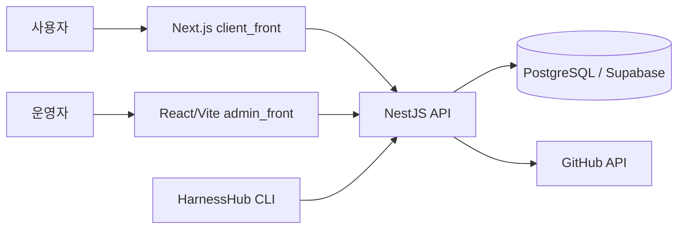

<div align="center">
  

  <h1>HarnessHub</h1>

  <p><strong>AI 에이전트 하네스를 찾고, 비교하고, 안전하게 도입하는 허브</strong></p>

  <p>
    <a href="https://harnesshub.kr">서비스 바로가기</a>
    &nbsp;&middot;&nbsp;
    <a href="https://harness-hub-api-production.up.railway.app/api/docs">API 문서</a>
    &nbsp;&middot;&nbsp;
    <a href="#빠른-시작">로컬 실행</a>
  </p>
</div>

---

## HarnessHub는 무엇인가요?

AI 생태계에는 코딩 에이전트, 브라우저 에이전트, RAG 프레임워크, 평가 하네스처럼 목적과 품질이 제각각인 도구가 빠르게 늘고 있습니다. HarnessHub는 이들을 한곳에 모아 **기능, 호환 모델, 벤치마크, 라이선스 위험도**를 기준으로 탐색할 수 있게 하는 AI 에이전트 디스커버리 플랫폼입니다.

단순한 링크 모음이 아니라, GitHub 메타데이터 동기화와 SPDX 라이선스 분류를 바탕으로 팀이 도입 전에 확인해야 할 정보를 빠르게 비교할 수 있도록 설계했습니다.

## 주요 기능

| 기능 | 설명 |
| --- | --- |
| 하네스 탐색 | 카테고리, 지원 모델, 언어, 라이선스 등급, 검증 여부, 키워드로 카탈로그를 필터링하고 정렬합니다. |
| 상세 비교 | GitHub 정보, README 요약, 설치 명령어, 벤치마크, 리뷰를 한 화면에서 확인합니다. |
| 라이선스 3단계 | SPDX 정보를 바탕으로 GREEN, YELLOW, RED 등급을 부여해 도입 전 라이선스 검토를 돕습니다. |
| 벤치마크 리더보드 | 하네스별 평가 점수와 사용 모델을 비교할 수 있습니다. |
| 컬렉션과 북마크 | 목적별 큐레이션을 탐색하고, 로그인한 사용자는 관심 하네스를 보관할 수 있습니다. |
| 등록 제안 | GitHub 저장소 URL로 새 하네스의 등록을 제안하면 검토 대기 상태로 생성됩니다. |
| AI 가이드 | 저장소 README를 바탕으로 한국어 요약, 활용 방법, 장단점, 사용 사례를 생성합니다. |
| GitHub 동기화 | 활성 하네스의 별, 포크, 이슈, README, 라이선스 정보를 12시간마다 갱신합니다. |

## 라이선스 등급

| 등급 | 의미 | 예시 |
| --- | --- | --- |
| GREEN | 상업적 사용에 비교적 적합한 허용형 라이선스 | MIT, Apache-2.0, BSD, ISC |
| YELLOW | 도입 전 의무 사항 검토가 필요한 카피레프트 계열 | GPL, AGPL, LGPL |
| RED | 라이선스가 없거나 불명확하고, 비상업 조건 등이 있는 저장소 | `NOASSERTION`, 비상업 라이선스 |

RED 등급 하네스는 공개 카탈로그에서 검토 대기 상태로 전환됩니다. 이 분류는 탐색을 돕기 위한 정보이며, 실제 사용 전에는 원본 라이선스를 반드시 확인해야 합니다.

## 서비스 화면

| 경로 | 내용 |
| --- | --- |
| `/ko`, `/en` | 주요 하네스, 카테고리, 플랫폼 통계를 보여주는 홈 |
| `/[locale]/explore` | 필터와 정렬을 지원하는 하네스 카탈로그 |
| `/[locale]/h/[org]/[name]` | 개별 하네스의 정보, 벤치마크, 리뷰, 설치 명령어 |
| `/[locale]/benchmarks` | 벤치마크 리더보드 |
| `/[locale]/collections` | 큐레이션 컬렉션과 상세 페이지 |
| `/[locale]/my-toolbox` | 로그인 사용자의 북마크 목록 |
| `/[locale]/submit` | 새 하네스 등록 제안 |
| `/[locale]/docs` | 서비스 내 사용 가이드와 변경 이력 |

## 구성

```text
harness-hub/
├── client_front/      # 사용자용 Next.js 서비스
├── admin_front/       # 콘텐츠와 사용자 관리를 위한 Vite 운영 콘솔
├── back/              # NestJS API, Prisma 스키마, 크롤러와 시드 데이터
├── cli/               # harnesshub 설치 CLI
└── render.yaml        # API 서버 컨테이너 배포 설정
```



## 기술 스택

| 영역 | 기술 |
| --- | --- |
| 사용자 서비스 | Next.js 16, React 19, TypeScript, Tailwind CSS 4, next-intl |
| 시각 경험 | React Three Fiber, Three.js, Framer Motion |
| 운영 콘솔 | React 19, Vite, Tailwind CSS, TanStack Query, Zustand |
| API | NestJS 11, Swagger, Pino, Cache Manager, Throttler |
| 데이터 | PostgreSQL, Prisma, Supabase Auth |
| 자동화 | GitHub API 크롤러, Groq 기반 AI 가이드 생성 |
| CLI | Node.js, Commander, Chalk |

## 빠른 시작

### 준비 사항

- Node.js `20.19` 이상
- npm
- PostgreSQL 데이터베이스 또는 Supabase 프로젝트
- GitHub API 동기화를 위한 Personal Access Token 권장

### 1. 저장소 내려받기

```bash
git clone https://github.com/dayainow/harness-hub.git
cd harness-hub
```

### 2. API 서버 설정 및 실행

`back/.env` 파일을 만들고 필요한 값을 설정합니다.

```bash
DATABASE_URL="postgresql://..."
DIRECT_URL="postgresql://..."
GITHUB_TOKEN="github-personal-access-token"
GROQ_API_KEY="optional-groq-api-key"
SUPABASE_JWT_SECRET="optional-supabase-jwt-secret"
ADMIN_SECRET="optional-admin-secret"
```

`DATABASE_URL`은 애플리케이션 런타임 연결에, `DIRECT_URL`은 Prisma 스키마 작업에 사용합니다. `GITHUB_TOKEN`과 `GROQ_API_KEY`가 없으면 각각 GitHub 요청 제한과 AI 가이드 기능에 영향이 있습니다.

```bash
cd back
npm install
npx prisma db push
npm run seed
npm run start:dev
```

API는 기본적으로 `http://localhost:3002`에서 실행되며, Swagger 문서는 `http://localhost:3002/api/docs`에서 확인할 수 있습니다.

### 3. 사용자 서비스 실행

새 터미널에서 `client_front/.env.local`을 만듭니다.

```bash
NEXT_PUBLIC_API_URL="http://localhost:3002/api"
NEXT_PUBLIC_SUPABASE_URL="https://your-project.supabase.co"
NEXT_PUBLIC_SUPABASE_ANON_KEY="your-anon-key"
NEXT_PUBLIC_SITE_URL="http://localhost:3000"
```

```bash
cd client_front
npm install
npm run dev
```

브라우저에서 `http://localhost:3000/ko` 또는 `http://localhost:3000/en`을 열면 됩니다.

### 4. 운영 콘솔 실행

운영 콘솔은 선택 사항입니다.

```bash
cd admin_front
yarn install
yarn dev
```

### 5. CLI 빌드와 로컬 테스트

```bash
cd cli
npm install
npm run build
npm link
harnesshub install princeton-nlp/SWE-agent
```

`HARNESSHUB_API_URL` 환경 변수로 CLI가 조회할 API 주소를 바꿀 수 있습니다.

## 자주 쓰는 명령어

| 위치 | 명령어 | 용도 |
| --- | --- | --- |
| `back` | `npm run start:dev` | API 개발 서버 실행 |
| `back` | `npm run build` | API 프로덕션 빌드 |
| `back` | `npm run test` | 단위 테스트 실행 |
| `back` | `npm run test:e2e` | E2E 테스트 실행 |
| `back` | `npm run seed` | 기본 하네스 데이터 시드 |
| `client_front` | `npm run dev` | 사용자 서비스 개발 서버 실행 |
| `client_front` | `npm run build` | Next.js 프로덕션 빌드 |
| `admin_front` | `yarn dev` | 운영 콘솔 개발 서버 실행 |
| `cli` | `npm run build` | CLI TypeScript 빌드 |

## API 개요

모든 API는 `/api` 접두사를 사용합니다. 실행 중인 서버의 전체 스펙은 Swagger에서 확인할 수 있습니다.

| 엔드포인트 | 설명 |
| --- | --- |
| `GET /api/harnesses` | 필터, 검색, 페이지네이션을 지원하는 하네스 목록 |
| `GET /api/harnesses/featured` | 큐레이션된 주요 하네스 |
| `GET /api/harnesses/stats` | 플랫폼 집계 통계 |
| `GET /api/harnesses/:org/:name` | 하네스 상세 정보 |
| `POST /api/harnesses/submit` | 하네스 등록 제안 |
| `GET /api/docs` | Swagger API 문서 |

## 배포

- `client_front`는 `vercel.json`을 포함해 Vercel 배포를 지원합니다.
- `back`은 Dockerfile과 `render.yaml`을 제공해 컨테이너 기반 API 배포를 지원합니다.
- 배포 환경에는 최소한 `DATABASE_URL`, `DIRECT_URL`, `GITHUB_TOKEN`을 설정해야 합니다.
- 크롤러는 서버가 동작하는 동안 12시간 주기로 활성 하네스 정보를 동기화합니다.

## 관련 리소스

- [Prisma 데이터 모델](back/prisma/schema.prisma)
- [API 서버 배포 설정](render.yaml)
- [클라이언트 배포 설정](client_front/vercel.json)
- [백엔드 인수인계 노트](AGENT_HANDOVER.md)

## 라이선스

이 저장소에는 별도의 `LICENSE` 파일이 포함되어 있지 않습니다. 사용, 수정, 재배포에 관한 권한은 저장소 소유자에게 확인해 주세요.
