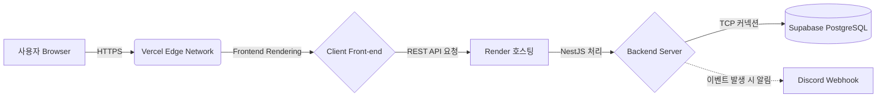

# ☁️ CI/CD 배포 파이프라인 및 인프라 설계서 (Deployment Guide)

Ola 프로젝트는 1인 풀스택 개발로 진행되었으나 확장성을 고려하여 인프라를 분리(MSA) 배치한 아키텍처를 가집니다. 

---

## 1. 인프라 아키텍처 다이어그램 (Infrastructure)



---

## 2. 모듈 별 호스팅 환경 (Hosting Specs)

### 2.1 프론트엔드 - Vercel (Front-end)
Next.js 프레임워크가 가지는 가장 강력한 엣지 캐싱(Edge Caching) 최적화를 100% 활용하기 위해 상성이 가장 잘 맞는 Vercel 플랫폼을 선택했습니다.
- **사용 기술**: Next.js 15, SSR/RSC 렌더러
- **배포 방식**: 원격 저장소(`harness-client`)에 `git subtree push`를 통한 자동 CI/CD 트리거 방식

### 2.2 백엔드 - Render (Back-end)
백엔드 로직은 Node.js 프로세스가 오퍼레이팅되며 지속 연결되는(Persistent) 특성이 있으므로, 웹서비스 배포와 로드밸런싱 인프라 관리에 유리한 Render 서비스를 사용합니다.
- **사용 기술**: NestJS 11, Node.js v20+ 엔진
- **특징**: `harness-backend-9f03.onrender.com` 과일 할당 주소를 통한 트래픽 라우팅 집중. 클라이언트에서 들어오는 CORS 제어를 수행합니다.

### 2.3 데이터베이스 - Supabase (Database & Auth)
- **DB (PostgreSQL)**: AWS ap-northeast-2 (서울) 로케이션 서버에 데이터베이스를 프로비저닝.
- **Connection 풀링 지원**: 다수의 연결로 인해 터지지 않도록 PgBouncer 레이어를 사용한 주소(`aws-1-ap-northeast-2.pooler.supabase.com:6543`)로 백엔드를 연결합니다.
- **인증 (Auth)**: 복잡한 OAuth 소셜 프로비저닝과, `Refresh Token` 갱신 로직을 손수 짜는 시간을 줄이고 보안을 강화하기 위해 Auth SaaS를 직접 프론트엔드단과 직결시켰습니다.

---

## 3. Git Subtree 배포 파이프라인 프로세스

우리는 "하나의 큰 깃허브 모노레포 폴더"에서 작업하고 있지만 배포 타겟 서버는 두 개이므로 아래와 같이 **Branch / Repo 쪼개기(Subtree)** 전략으로 빌드를 트리거합니다.

**✅ [Frontend] Vercel 재배포 트리거 시**
```bash
# 로컬 client_front 폴더 내의 수정분만 harness-client 레포지토리 메인 라인으로 이관/통신
git subtree push --prefix client_front harness-client main
```

**✅ [Backend] Render 재배포 트리거 시**
```bash
# 로컬 back 폴더 내의 수정분만 harness-backend 레포지토리 메인으로 이관/통신 (Nestjs Build)
git subtree push --prefix back harness-backend main
```
